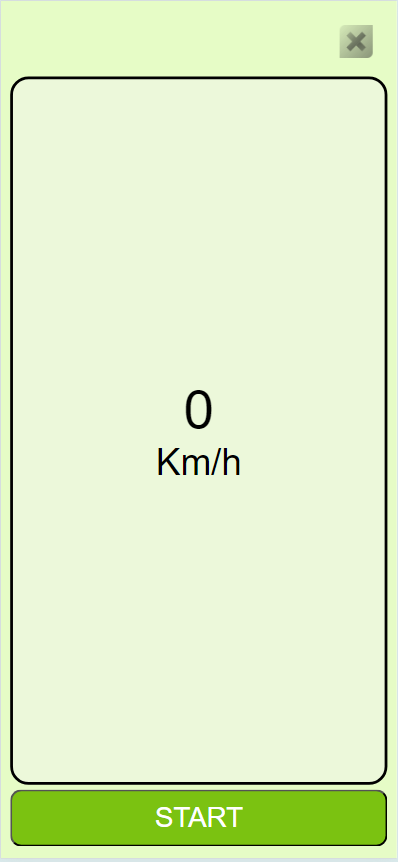
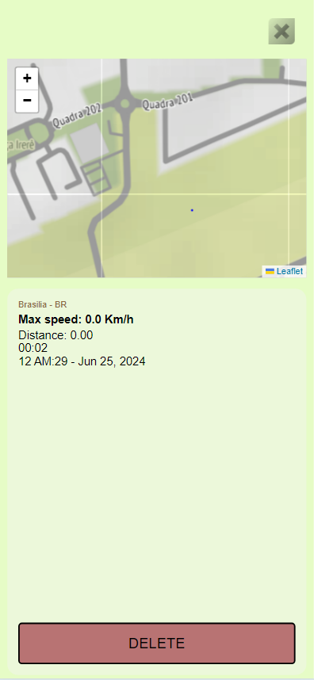
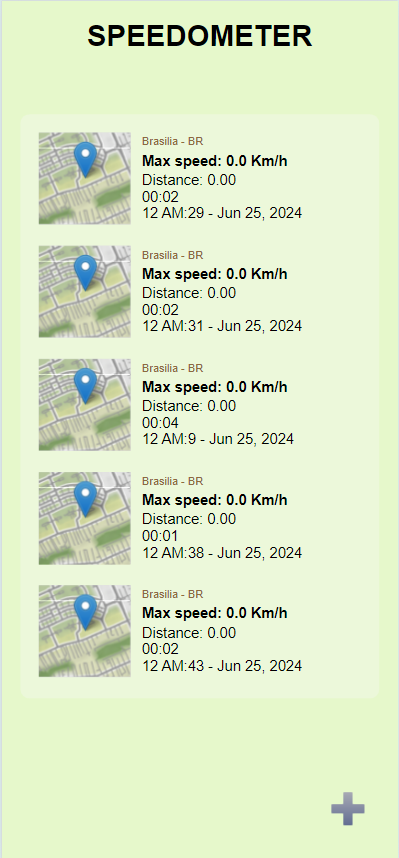

# Projeto de Mapeamento de Movimentos

## Descrição

Este projeto é uma aplicação web desenvolvida com HTML, CSS e JavaScript, que utiliza a API de Geolocalização do Google para capturar os movimentos do usuário no mapa. As marcações feitas no mapa são gerenciadas e exibidas utilizando a API do Leaflet.

## Funcionalidades

- Captura de movimentos do usuário em tempo real utilizando a API de Geolocalização do Google.



- Inserção e visualização de marcações no mapa utilizando a API do Leaflet.



- Interface amigável para visualização dos trajetos percorridos.



## Tecnologias Utilizadas

- **HTML**: Estruturação do conteúdo da aplicação.
- **CSS**: Estilização e layout da aplicação.
- **JavaScript**: Lógica de programação e interação com APIs.
- **API de Geolocalização do Google**: Captura da localização do usuário.
- **Leaflet**: Biblioteca de mapas interativa para exibição e manipulação das marcações no mapa.

## Pré-requisitos

Para executar o projeto, você precisará de:

- Um navegador web moderno (Chrome, Firefox, Edge, etc.)
- Conexão com a internet para acessar as APIs

## Como Executar o Projeto

1. Clone este repositório para o seu ambiente local:
   ```bash
   git clone https://github.com/Joaozinm/speedometer.git

2. Navegue até o diretório do projeto:
    ```bash
    cd speedometer

3. Abra o arquivo index.html em seu navegador web.

4. Certifique-se de que o projeto tenha acesso à internet para carregar a biblioteca do Leaflet e outras dependências externas.

## Estrutura do Projeto

    .
    ├── Assets # Arquivo de media
    ├── css
    │   └── detail.css
    │   └── index.css
    │   └── speedometer.css  # Arquivo de estilos CSS
    ├── JsFiles
    │   └── dataManager.js # Arquivo dataManager de JavaScript
    │   └── detail.js # Arquivo detail de JavaScript
    │   └── index.js # Arquivo home de JavaScript
    │   └── speedometer.js # Arquivo speedometer de JavaScript
    │   └── storage.js  # Arquivo storage de JavaScript     
    ├── detail.html # HTML do Detail
    ├── global.css     # CSS global
    ├── speedometer.html          # HTML do Speedometer
    └── README.md           # Documentação do projeto

## Como Contribuir

1. Faça um fork deste repositório.

2. Crie uma branch com sua feature: git checkout -b minha-feature

3. Commit suas mudanças: git commit -m 'Adiciona minha feature'

4. Push para a branch: git push origin minha-feature

5. Abra um Pull Request.

## Contato
Para mais informações, entre em contato com João Melo.